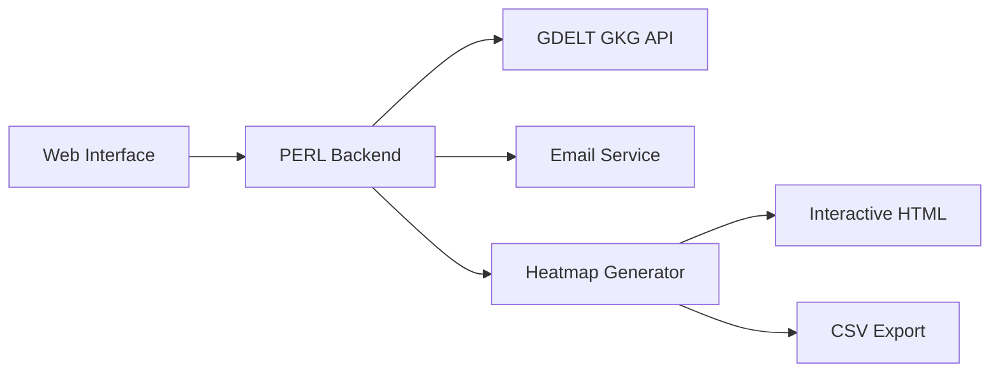

# GKG Heatmap Visualizer

🌍 **Interactive Geographic Heatmap Visualization from GDELT Global Knowledge Graph**

[](sample-heatmap.html)
[](docs/README.md)
[](LICENSE)

The GKG Heatmap Visualizer allows you to rapidly construct geographic heatmaps from the GDELT Global Knowledge Graph (GKG) to understand spatial patterns in global news coverage and media attention.


## 🚀 Features

- **🗺️ Interactive Heatmaps**: Browser-based visualizations with Google Maps integration
- **📊 CSV Data Export**: Import-ready data for GIS software analysis  
- **🔍 Powerful Search**: Boolean logic with person/org names, locations, and themes
- **📈 Dual Weighting Methods**: Namesets (diversity) or Articles (frequency)
- **📧 Email Delivery**: Automated result delivery with processing notifications
- **🎛️ Interactive Controls**: Adjust intensity, radius, and opacity in real-time
- **📱 Responsive Design**: Works seamlessly on desktop and mobile devices

## 🎯 Quick Start

### 1. **Open the Interface**
Navigate to [`index.html`](index.html) in your web browser or deploy to a web server.

### 2. **Fill the Form**
- **Email**: Where to send results
- **Date Range**: April 1, 2013 to present day
- **Search Keywords**: People, places, organizations, or themes
- **Weighting Method**: Namesets (recommended) or Articles

### 3. **Get Results**
Receive email with interactive heatmap and CSV data (typically within 10 minutes).

## 📋 Example Use Cases

### **Political Analysis**
```
Search: "Vladimir Putin"
Output: Global hotspots of Putin-related coverage
```

### **Crisis Monitoring** 
```
Include All: "Nigeria"
Include Any: "WATER_SECURITY, FOOD_SECURITY" 
Output: Food/water security coverage in Nigeria
```

### **Event Tracking**
```
Include Any: "CLIMATE_CHANGE, GLOBAL_WARMING"
Date Range: Conference dates
Output: Climate discussion geographic patterns
```

## 🏗️ System Architecture



## 📁 Project Structure

```
gkg-heatmap/
├── 🌐 index.html              # Main web interface
├── 🎨 css/styles.css          # Interface styling  
├── ⚡ js/form-validation.js   # Client-side validation
├── 🔧 cgi-bin/gkg_processor.pl # PERL backend
├── 📊 sample-heatmap.html     # Demo visualization
├── 📈 sample-locations.csv    # Sample CSV data
└── 📚 docs/                   # Complete documentation
    ├── README.md              # User guide
    ├── INSTALL.md             # Installation guide
    └── API.md                 # API documentation
```

## 🛠️ Installation

### **Requirements**
- **Web Server**: Apache/Nginx with CGI support
- **PERL**: 5.10+ with CGI, JSON, MIME::Lite modules
- **Browser**: Modern JavaScript/CSS support

### **Quick Deploy**
```bash
# Copy files to web directory
cp -r gkg-heatmap/ /var/www/html/

# Set permissions
chmod +x /var/www/html/gkg-heatmap/cgi-bin/*.pl
mkdir -p /var/www/html/gkg-heatmap/data/{results,temp,logs}
chmod 777 /var/www/html/gkg-heatmap/data/*
```

📖 **[Full Installation Guide →](docs/INSTALL.md)**

## 🎮 Try the Demo

Experience the visualization with our **[Sample Heatmap](sample-heatmap.html)** showing simulated global news coverage patterns.

## 📊 Output Formats

### **Interactive Heatmap (HTML)**
- 🗺️ Google Maps overlay with heatmap.js
- 🎛️ Real-time intensity/radius/opacity controls
- 🔍 Zoom and pan functionality
- 📱 Mobile-responsive design

### **CSV Data Export**
```csv
Latitude,Longitude,Location,Count,Average_Tone
40.712800,-74.006000,New York City,245,12.50
51.507400,-0.127800,London,198,-5.20
35.676200,139.650300,Tokyo,167,8.10
```

Perfect for GIS software like ArcGIS, QGIS, or Tableau.

## 🔬 Data Source

**GDELT Global Knowledge Graph (GKG)**
- 📅 **Coverage**: April 1, 2013 → Present
- 🔄 **Updates**: Every 15 minutes  
- 🌍 **Scope**: Worldwide, 65+ languages
- 📋 **Content**: Locations, people, organizations, themes, sentiment

## 💡 Technical Highlights

### **Search Capabilities**
- **Boolean Logic**: AND/OR combinations across search fields
- **Case Insensitive**: Automatic keyword normalization
- **Flexible Criteria**: Names, places, themes, and combinations

### **Location Weighting**
- **Namesets**: Weight by context diversity (stable trends)
- **Articles**: Weight by frequency (event sensitivity)

### **Performance**
- **Asynchronous Processing**: Non-blocking request handling
- **Email Delivery**: Reliable result notification
- **Scalable Architecture**: Handle multiple concurrent requests

## 🤝 Contributing

We welcome contributions! Areas for enhancement:

- 🚀 **Performance**: Database caching, query optimization
- 🎨 **Visualization**: Additional map layers, chart types
- 🔍 **Search**: Advanced filtering, saved queries
- 📧 **Notifications**: SMS, webhooks, real-time updates

## 📄 License

MIT License - see [LICENSE](LICENSE) for details.

### **Acknowledgments**
- **[heatmap.js](https://www.patrick-wied.at/static/heatmapjs/)** - JavaScript heatmap library
- **[Google Maps API](https://developers.google.com/maps)** - Interactive mapping
- **[GDELT Project](https://www.gdeltproject.org/)** - Global event data
- **Creative Commons** - Open data licensing

## 🆘 Support

### **Documentation**
- 📖 **[User Guide](docs/README.md)** - Complete usage instructions
- 🛠️ **[Installation](docs/INSTALL.md)** - Setup and configuration  
- 🔌 **[API Docs](docs/API.md)** - Integration reference

### **Troubleshooting**
- ✅ Verify email address format
- 📅 Check date ranges (2013-04-01 minimum)
- 🔍 Try broader keywords if no results
- 📧 Check spam folder for results

### **Getting Help**
1. Review error messages and logs
2. Check system requirements
3. Verify server configuration
4. Contact administrator with specific errors

---

**🌟 Star this project if you find it useful!**

*Transform global news data into actionable geographic insights.*