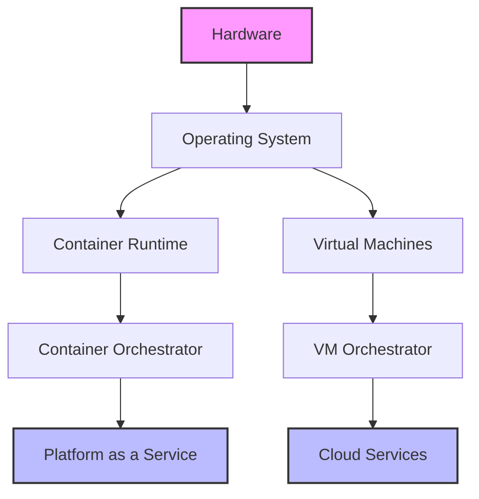

# 🧠 Meta-Learning & Transferability Framework

## Introduction to Meta-Learning in Technical Education

Meta-learning, or "learning how to learn," focuses on developing transferable skills and pattern recognition capabilities that extend beyond specific technologies or tools. In the rapidly evolving landscape of software development and DevOps, these skills become increasingly valuable as they enable professionals to adapt quickly to new technologies and approaches.

## 🔍 Core Meta-Learning Concepts

### 1. Pattern Recognition Across Technologies

**Concept**: Identifying abstract patterns that appear consistently across different tools and domains.

**Example: Container Abstraction Patterns**

```yaml
# Pattern: Resource Isolation
containerization:
  docker:
    mechanism: "cgroups + namespaces"
    syntax: "docker run --memory=1g --cpus=0.5"
    
  podman:
    mechanism: "cgroups + namespaces" 
    syntax: "podman run --memory=1g --cpus=0.5"
    
  kubernetes:
    mechanism: "cgroups + namespaces"
    syntax: |
      resources:
        limits:
          memory: "1Gi"
          cpu: "500m"

# The PATTERN is resource isolation through kernel features
# The IMPLEMENTATION varies by tool
```

**Learning Transfer**:
- Understanding that container isolation is fundamentally about kernel features
- Recognizing that syntax differs but underlying concepts remain consistent
- Applying this knowledge when encountering new container tools (LXC, containerd, etc.)

### 2. Abstraction Hierarchies

**Concept**: Understanding how technologies build upon each other in layers of abstraction.



**Meta-Learning Application**:
```python
class AbstractionLayer:
    def __init__(self, name, abstracts_over, provides_to):
        self.name = name
        self.abstracts_over = abstracts_over  # Lower layer complexity
        self.provides_to = provides_to        # Higher layer interface
        
    def identify_patterns(self):
        return {
            'resource_management': self.how_resources_managed(),
            'failure_handling': self.how_failures_handled(),
            'scaling_mechanism': self.how_scaling_works(),
            'configuration_approach': self.how_configuration_works()
        }

# Example: Kubernetes abstracts container runtime complexity
kubernetes = AbstractionLayer(
    name="Kubernetes",
    abstracts_over="Container Runtime (Docker/containerd)",
    provides_to="Platform Services (Helm/Operators)"
)

# Pattern Recognition: Every abstraction layer provides similar capabilities
# - Resource management
# - Failure handling  
# - Scaling mechanisms
# - Configuration management
```

### 3. Trade-off Recognition Patterns

**Concept**: Understanding that similar trade-offs appear across different technology choices.

**Universal Trade-off Patterns**:

```typescript
interface TechnologyTradeOff {
  dimension: string;
  options: TradeOffOption[];
}

interface TradeOffOption {
  name: string;
  benefits: string[];
  costs: string[];
  contexts_where_optimal: string[];
}

const universalTradeOffs: TechnologyTradeOff[] = [
  {
    dimension: "Complexity vs Control",
    options: [
      {
        name: "High Abstraction (Managed Services)",
        benefits: ["Less operational overhead", "Faster time to market"],
        costs: ["Less control", "Potential vendor lock-in"],
        contexts_where_optimal: ["Startups", "Non-core systems", "Rapid prototyping"]
      },
      {
        name: "Low Abstraction (Self-managed)",
        benefits: ["Full control", "Customization possible"],
        costs: ["Higher operational overhead", "More expertise required"],
        contexts_where_optimal: ["Core systems", "Specific requirements", "Long-term strategy"]
      }
    ]
  },
  {
    dimension: "Performance vs Flexibility",
    options: [
      {
        name: "Specialized Solutions",
        benefits: ["Optimized performance", "Lower resource usage"],
        costs: ["Limited flexibility", "Technology lock-in"],
        contexts_where_optimal: ["Performance-critical", "Well-defined requirements"]
      },
      {
        name: "General Purpose Solutions",
        benefits: ["Flexibility", "Broader applicability"],
        costs: ["Performance overhead", "Complexity for simple use cases"],
        contexts_where_optimal: ["Uncertain requirements", "Multiple use cases"]
      }
    ]
  }
];

// Meta-learning: These trade-off patterns appear everywhere
// - Programming languages (Python vs C++)
// - Databases (SQL vs NoSQL)
// - Architecture patterns (Monolith vs Microservices)
// - Deployment strategies (VM vs Container vs Serverless)
```

### 4. Learning Transfer Strategies

**Strategy 1: Concept Mapping**

```python
class ConceptMap:
    def __init__(self):
        self.concepts = {}
        self.relationships = []
    
    def map_concept_across_domains(self, abstract_concept, implementations):
        """Map abstract concept to concrete implementations"""
        self.concepts[abstract_concept] = {
            'implementations': implementations,
            'transferable_principles': self.extract_principles(implementations),
            'context_variations': self.identify_context_variations(implementations)
        }
    
    def extract_principles(self, implementations):
        """Extract transferable principles from implementations"""
        return {
            'core_function': self.identify_core_function(implementations),
            'common_patterns': self.find_common_patterns(implementations),
            'universal_constraints': self.identify_constraints(implementations)
        }

# Example: Service Discovery concept
service_discovery_map = ConceptMap()
service_discovery_map.map_concept_across_domains(
    'service_discovery',
    {
        'consul': {'mechanism': 'gossip_protocol', 'storage': 'kv_store'},
        'kubernetes': {'mechanism': 'dns_based', 'storage': 'etcd'},
        'aws_service_mesh': {'mechanism': 'envoy_proxy', 'storage': 'control_plane'},
        'nginx': {'mechanism': 'configuration_file', 'storage': 'static'}
    }
)

# Transferable principle: All service discovery needs
# 1. Service registration mechanism
# 2. Service query interface  
# 3. Health checking capability
# 4. Configuration propagation
```

**Strategy 2: Pattern Templates**

```typescript
interface PatternTemplate {
  name: string;
  problem: string;
  solution_structure: SolutionStructure;
  implementation_variations: ImplementationVariation[];
  transferability_markers: string[];
}

interface SolutionStructure {
  components: string[];
  interactions: string[];
  constraints: string[];
}

const loadBalancingPattern: PatternTemplate = {
  name: "Load Distribution",
  problem: "Distribute work across multiple resources to improve performance and availability",
  solution_structure: {
    components: ["Load Balancer", "Backend Services", "Health Checker"],
    interactions: ["Request Routing", "Health Monitoring", "Failure Detection"],
    constraints: ["Consistency Requirements", "Latency Tolerance", "Resource Limits"]
  },
  implementation_variations: [
    {
      domain: "Web Servers",
      tools: ["nginx", "haproxy", "aws_alb"],
      specific_considerations: ["HTTP headers", "Session affinity", "SSL termination"]
    },
    {
      domain: "Databases", 
      tools: ["pgbouncer", "mysql_router", "mongodb_sharding"],
      specific_considerations: ["Read/write splitting", "Connection pooling", "Data consistency"]
    },
    {
      domain: "Message Queues",
      tools: ["kafka_partitioning", "rabbitmq_clustering", "sqs_sharding"], 
      specific_considerations: ["Message ordering", "Delivery guarantees", "Consumer groups"]
    },
    {
      domain: "Microservices",
      tools: ["istio", "linkerd", "consul_connect"],
      specific_considerations: ["Service mesh", "Circuit breaking", "Retry policies"]
    }
  ],
  transferability_markers: [
    "Resource pooling concept",
    "Health monitoring requirement", 
    "Routing strategy decision",
    "Failure handling mechanism"
  ]
};

// Learning Application: When encountering any new system requiring load distribution,
// learners can apply this pattern template to quickly understand and implement solutions
```

## 🚀 Practical Meta-Learning Exercises

### Exercise 1: Cross-Domain Pattern Recognition

**Objective**: Identify the same underlying pattern across different technology domains.

```python
def pattern_recognition_exercise():
    """
    Given multiple implementations of the same abstract concept,
    identify the transferable patterns
    """
    
    # Configuration Management Examples
    configurations = {
        'docker_compose': {
            'format': 'yaml',
            'structure': 'services -> containers',
            'environment': 'env_vars + env_files',
            'secrets': 'external_files',
            'networking': 'automatic_service_discovery'
        },
        'kubernetes_manifests': {
            'format': 'yaml', 
            'structure': 'resources -> pods',
            'environment': 'configmaps + secrets',
            'secrets': 'secret_resources',
            'networking': 'service_objects + dns'
        },
        'terraform': {
            'format': 'hcl',
            'structure': 'resources -> cloud_services', 
            'environment': 'variables + locals',
            'secrets': 'sensitive_variables',
            'networking': 'explicit_resource_definition'
        },
        'ansible': {
            'format': 'yaml',
            'structure': 'playbooks -> tasks',
            'environment': 'vars + host_vars',
            'secrets': 'vault',
            'networking': 'inventory + connection_params'
        }
    }
    
    # Student Task: Identify common patterns
    common_patterns = extract_patterns(configurations)
    
    return {
        'identified_patterns': common_patterns,
        'transferable_skills': [
            'YAML/structured configuration literacy',
            'Environment variable management',
            'Secret handling best practices',
            'Service discovery concepts',
            'Infrastructure as code principles'
        ],
        'future_applicability': [
            'Any new IaC tool will likely have similar patterns',
            'Configuration skills transfer to new orchestration tools',
            'Security patterns apply across platforms'
        ]
    }

def extract_patterns(configurations):
    """Extract common patterns across all configurations"""
    patterns = {}
    
    # Find common elements
    all_keys = set()
    for config in configurations.values():
        all_keys.update(config.keys())
    
    for key in all_keys:
        implementations = []
        for tool, config in configurations.items():
            if key in config:
                implementations.append({'tool': tool, 'approach': config[key]})
        
        if len(implementations) > 1:
            patterns[key] = {
                'universal_need': True,
                'implementations': implementations,
                'transferable_concept': infer_transferable_concept(key, implementations)
            }
    
    return patterns
```

### Exercise 2: Technology Evolution Prediction

**Objective**: Use meta-learning to predict likely evolution paths for technologies.

```python
class TechnologyEvolutionPredictor:
    def __init__(self):
        self.historical_patterns = self.load_historical_evolution_patterns()
    
    def predict_evolution(self, current_technology, pain_points):
        """Predict likely evolution based on historical patterns"""
        
        # Identify current stage in typical evolution cycle
        current_stage = self.identify_evolution_stage(current_technology)
        
        # Find similar historical evolutions
        similar_evolutions = self.find_similar_patterns(current_technology, pain_points)
        
        # Predict next stage
        likely_next_stage = self.predict_next_stage(current_stage, similar_evolutions)
        
        return {
            'current_stage': current_stage,
            'pain_points_analysis': self.analyze_pain_points(pain_points),
            'predicted_evolution': likely_next_stage,
            'preparation_recommendations': self.generate_preparation_advice(likely_next_stage)
        }
    
    def load_historical_evolution_patterns(self):
        return {
            'containerization_evolution': [
                {'stage': 'manual_deployment', 'pain_points': ['inconsistent_environments', 'deployment_complexity']},
                {'stage': 'virtual_machines', 'pain_points': ['resource_overhead', 'slow_startup']},
                {'stage': 'containers', 'pain_points': ['orchestration_complexity', 'networking']}, 
                {'stage': 'container_orchestration', 'pain_points': ['configuration_complexity', 'operational_overhead']},
                {'stage': 'serverless_containers', 'pain_points': ['cold_starts', 'vendor_lock_in']},
                {'stage': 'wasm_containers', 'pain_points': ['ecosystem_maturity', 'tooling_gaps']}
            ],
            'database_evolution': [
                {'stage': 'file_systems', 'pain_points': ['data_integrity', 'concurrent_access']},
                {'stage': 'relational_databases', 'pain_points': ['scaling_limitations', 'schema_rigidity']},
                {'stage': 'nosql_databases', 'pain_points': ['consistency_models', 'query_limitations']},
                {'stage': 'multi_model_databases', 'pain_points': ['complexity', 'performance_optimization']},
                {'stage': 'database_as_service', 'pain_points': ['vendor_lock_in', 'cost_optimization']}
            ]
        }
    
    def identify_evolution_stage(self, technology):
        """Identify current evolutionary stage of a technology"""
        # Implementation would analyze technology characteristics
        # and map to known evolutionary patterns
        pass
    
    def generate_preparation_advice(self, predicted_evolution):
        """Generate advice for preparing for predicted technological evolution"""
        return [
            f"Study foundational concepts that will transfer: {predicted_evolution.get('transferable_concepts', [])}",
            f"Experiment with emerging tools: {predicted_evolution.get('emerging_tools', [])}",
            f"Develop skills in: {predicted_evolution.get('required_skills', [])}",
            f"Monitor these indicators: {predicted_evolution.get('evolution_signals', [])}"
        ]

# Example usage
predictor = TechnologyEvolutionPredictor()

# Predict evolution of container orchestration
prediction = predictor.predict_evolution(
    current_technology='kubernetes',
    pain_points=['configuration_complexity', 'learning_curve', 'operational_overhead']
)

print("Technology Evolution Prediction:")
print(f"Current Stage: {prediction['current_stage']}")
print(f"Predicted Next Stage: {prediction['predicted_evolution']}")
print(f"Preparation Advice: {prediction['preparation_recommendations']}")
```

### Exercise 3: Abstraction Level Navigation

**Objective**: Practice moving between different levels of abstraction to solve problems.

```yaml
# Abstraction Navigation Exercise
problem: "Application won't start in production"

# Level 1: Symptom Level
symptoms:
  - "Container exits immediately"
  - "No error logs visible"
  - "Works fine in development"

# Level 2: Application Level  
application_analysis:
  - "Environment variables missing"
  - "Dependencies not available"
  - "Configuration file not found"

# Level 3: Container Level
container_analysis:
  - "Image missing required files"
  - "Wrong base image used"
  - "Build context issues"

# Level 4: Infrastructure Level
infrastructure_analysis:
  - "Resource constraints"
  - "Network policies blocking access"
  - "Storage not mounted correctly"

# Level 5: System Level
system_analysis:
  - "Kernel version incompatibility"
  - "Hardware resource limits"
  - "Security policy restrictions"

# Meta-Learning: Navigation Strategy
navigation_strategy:
  start_level: "symptom_level"
  investigation_path:
    - "Gather observable symptoms"
    - "Form hypothesis at current level"
    - "Test hypothesis"
    - "If hypothesis fails, move to deeper level"
    - "If hypothesis succeeds, implement solution"
    - "Verify solution at original symptom level"
  
# Transferable Skills:
transferable_debugging_approach:
  - "Systematic level-by-level investigation"
  - "Hypothesis formation and testing"
  - "Understanding abstraction boundaries"
  - "Root cause analysis methodology"
```

## 🔮 Future-Proofing Through Meta-Learning

### 1. Technology-Agnostic Skill Development

**Core Skills That Transfer Across Technologies**:

```python
class TransferableSkills:
    def __init__(self):
        self.skill_categories = {
            'systems_thinking': {
                'description': 'Understanding how components interact in complex systems',
                'applications': ['any_distributed_system', 'any_architecture_pattern'],
                'practice_methods': ['system_diagramming', 'failure_mode_analysis', 'capacity_planning']
            },
            'abstraction_design': {
                'description': 'Creating and working with different levels of abstraction',
                'applications': ['api_design', 'configuration_management', 'user_interfaces'],
                'practice_methods': ['interface_design', 'layered_architecture', 'protocol_design']
            },
            'pattern_recognition': {
                'description': 'Identifying recurring solutions to similar problems',
                'applications': ['design_patterns', 'architectural_patterns', 'troubleshooting'],
                'practice_methods': ['cross_domain_comparison', 'solution_categorization', 'template_creation']
            },
            'trade_off_analysis': {
                'description': 'Evaluating competing solutions based on context',
                'applications': ['technology_selection', 'architecture_decisions', 'optimization_strategies'],
                'practice_methods': ['decision_matrices', 'cost_benefit_analysis', 'scenario_planning']
            }
        }
    
    def develop_transferable_skill(self, skill_name, current_domain, target_domains):
        """Create practice plan for developing transferable skills"""
        skill = self.skill_categories.get(skill_name)
        if not skill:
            return None
            
        return {
            'skill': skill_name,
            'current_practice': self.create_practice_plan(skill, current_domain),
            'transfer_exercises': [
                self.create_transfer_exercise(skill, current_domain, target)
                for target in target_domains
            ],
            'assessment_criteria': self.create_assessment_criteria(skill),
            'mastery_indicators': self.define_mastery_indicators(skill)
        }

# Example: Developing systems thinking through container orchestration
skill_development = TransferableSkills()
plan = skill_development.develop_transferable_skill(
    'systems_thinking',
    current_domain='container_orchestration',
    target_domains=['distributed_databases', 'microservices', 'cdn_networks']
)
```

### 2. Learning Acceleration Strategies

**Strategy: Pattern-First Learning**

```python
class PatternFirstLearning:
    """Learn abstract patterns first, then specific implementations"""
    
    def __init__(self):
        self.learning_sequence = [
            'identify_abstract_pattern',
            'understand_pattern_purpose',
            'explore_implementation_variations',
            'practice_pattern_application',
            'transfer_to_new_domains'
        ]
    
    def learn_pattern(self, pattern_name):
        """Structured approach to learning transferable patterns"""
        
        # Step 1: Abstract pattern identification
        abstract_pattern = self.identify_pattern(pattern_name)
        
        # Step 2: Purpose and principles
        principles = self.extract_principles(abstract_pattern)
        
        # Step 3: Implementation variations
        implementations = self.collect_implementations(pattern_name)
        
        # Step 4: Practice applications
        practice_exercises = self.generate_practice(pattern_name, implementations)
        
        # Step 5: Transfer opportunities
        transfer_domains = self.identify_transfer_opportunities(pattern_name)
        
        return {
            'abstract_pattern': abstract_pattern,
            'core_principles': principles,
            'implementations': implementations,
            'practice_plan': practice_exercises,
            'transfer_opportunities': transfer_domains
        }

# Example: Learning "Circuit Breaker" pattern
pattern_learning = PatternFirstLearning()
circuit_breaker_learning = pattern_learning.learn_pattern('circuit_breaker')

# This approach enables rapid learning of new implementations
# because the abstract pattern is already understood
```

### 3. Continuous Learning Framework

```typescript
interface ContinuousLearningFramework {
  monitoring: TechnologyMonitoring;
  assessment: SkillGapAssessment;  
  learning: AdaptiveLearningPlan;
  application: PracticalApplication;
  evaluation: ProgressEvaluation;
}

class TechnologyMonitoring {
  scanEmergingTechnologies(): EmergingTechnology[] {
    // Monitor tech blogs, conferences, open source projects
    // Identify trending technologies and patterns
    return [];
  }
  
  assessRelevance(tech: EmergingTechnology, currentSkills: Skill[]): RelevanceScore {
    // Determine relevance based on:
    // - Career trajectory
    // - Industry trends
    // - Transferability from current skills
    return { score: 0.8, reasoning: "High transferability from existing container knowledge" };
  }
}

class SkillGapAssessment {
  identifyGaps(targetTechnology: string, currentSkills: Skill[]): SkillGap[] {
    // Compare required skills for target technology
    // with current skill set to identify gaps
    return [];
  }
  
  prioritizeGaps(gaps: SkillGap[], learningGoals: LearningGoal[]): PrioritizedGap[] {
    // Prioritize gaps based on:
    // - Impact on learning goals
    // - Transferability to other technologies
    // - Foundation for future learning
    return [];
  }
}

// Usage example: Staying current with container ecosystem evolution
const framework: ContinuousLearningFramework = {
  monitoring: new TechnologyMonitoring(),
  assessment: new SkillGapAssessment(),
  learning: new AdaptiveLearningPlan(),
  application: new PracticalApplication(), 
  evaluation: new ProgressEvaluation()
};

// Continuous cycle:
// 1. Monitor emerging technologies (WebAssembly containers, unikernels)
// 2. Assess skill gaps (WASM runtime knowledge, security model differences)
// 3. Create learning plan (focus on transferable concepts first)
// 4. Apply through practical projects (implement WASM container deployment)
// 5. Evaluate and adjust (measure learning effectiveness, update approach)
```

## 📊 Meta-Learning Assessment Framework

### Self-Assessment Tools

```python
class MetaLearningAssessment:
    def __init__(self):
        self.assessment_dimensions = {
            'pattern_recognition': {
                'novice': 'Can identify patterns when explicitly pointed out',
                'advanced_beginner': 'Recognizes common patterns in familiar domains',
                'competent': 'Identifies patterns across related domains',
                'proficient': 'Discovers new patterns and their variations',
                'expert': 'Creates new pattern abstractions and teaches pattern recognition'
            },
            'transfer_ability': {
                'novice': 'Learns each technology from scratch',
                'advanced_beginner': 'Applies some skills from familiar to similar technologies',
                'competent': 'Systematically transfers concepts across domains',
                'proficient': 'Accelerates learning through pattern transfer',
                'expert': 'Predicts technology evolution and prepares accordingly'
            },
            'abstraction_navigation': {
                'novice': 'Works at single level of abstraction',
                'advanced_beginner': 'Moves between adjacent abstraction levels',
                'competent': 'Navigates multiple levels for problem solving',
                'proficient': 'Chooses optimal abstraction level for given context',
                'expert': 'Designs new abstraction layers and interfaces'
            }
        }
    
    def assess_meta_learning_level(self, evidence: Dict[str, List[str]]) -> Dict[str, str]:
        """Assess current meta-learning capability level"""
        results = {}
        
        for dimension, levels in self.assessment_dimensions.items():
            user_evidence = evidence.get(dimension, [])
            assessed_level = self.evaluate_evidence(user_evidence, levels)
            results[dimension] = assessed_level
            
        return results
    
    def generate_development_plan(self, current_levels: Dict[str, str]) -> Dict[str, List[str]]:
        """Generate plan to develop meta-learning capabilities"""
        development_plan = {}
        
        for dimension, current_level in current_levels.items():
            next_level = self.get_next_level(dimension, current_level)
            development_activities = self.get_development_activities(dimension, next_level)
            development_plan[dimension] = development_activities
            
        return development_plan

# Self-assessment example
assessment = MetaLearningAssessment()

# Evidence of meta-learning capabilities
evidence = {
    'pattern_recognition': [
        "Recognized that Kubernetes Deployments and Docker Compose services solve similar problems",
        "Identified load balancing pattern across nginx, HAProxy, and AWS ALB",
        "Connected database connection pooling to HTTP connection pooling concepts"
    ],
    'transfer_ability': [
        "Used Docker knowledge to quickly understand Podman",
        "Applied containerization concepts to understand VM orchestration",
        "Transferred API design patterns from REST to GraphQL"
    ],
    'abstraction_navigation': [
        "Debugged application issues by examining container, orchestration, and infrastructure layers",
        "Designed APIs that hide infrastructure complexity from applications",
        "Chose appropriate abstraction level for different stakeholder communications"
    ]
}

current_levels = assessment.assess_meta_learning_level(evidence)
development_plan = assessment.generate_development_plan(current_levels)

print("Current Meta-Learning Levels:", current_levels)
print("Development Plan:", development_plan)
```

## 🎯 Practical Applications

### Creating Technology-Agnostic Learning Materials

```markdown
# Template: Technology-Agnostic Concept Guide

## Abstract Concept: [Service Discovery]

### Core Problem
How do services find and communicate with each other in distributed systems?

### Universal Principles
1. **Service Registration**: Services announce their availability and location
2. **Service Discovery**: Clients locate available services
3. **Health Monitoring**: System tracks service health and availability
4. **Load Distribution**: Requests distributed across available instances

### Implementation Patterns

#### Pattern 1: DNS-Based Discovery
- **Mechanism**: Use DNS records to map service names to locations
- **Examples**: Kubernetes Services, AWS Route 53, Consul DNS
- **Trade-offs**: Simple but limited health checking, caching challenges

#### Pattern 2: Service Registry  
- **Mechanism**: Central registry where services register and clients query
- **Examples**: Consul, Eureka, etcd + custom logic
- **Trade-offs**: More features but additional infrastructure complexity

#### Pattern 3: Sidecar Proxy
- **Mechanism**: Proxy handles service discovery and communication
- **Examples**: Istio/Envoy, Linkerd, AWS App Mesh  
- **Trade-offs**: Powerful features but adds latency and complexity

### Learning Exercises

#### Exercise 1: Cross-Implementation Comparison
Compare how the same service discovery scenario works across:
- Docker Compose (built-in DNS)
- Kubernetes (Service objects + DNS)
- AWS (ELB + Target Groups)
- Service Mesh (Envoy sidecars)

#### Exercise 2: Pattern Transfer
Apply service discovery concepts to:
- Database cluster discovery
- Content delivery network routing  
- Microservice communication
- IoT device management

### Assessment Questions
1. What are the core requirements any service discovery solution must address?
2. How would you evaluate which pattern is appropriate for a given context?
3. What principles from service discovery apply to other distributed system problems?
```

---

This meta-learning framework equips learners with skills that transcend specific technologies, enabling them to adapt quickly to new tools and evolving ecosystems. The focus on patterns, abstractions, and transferable skills creates more resilient and capable professionals who can navigate technological change with confidence.