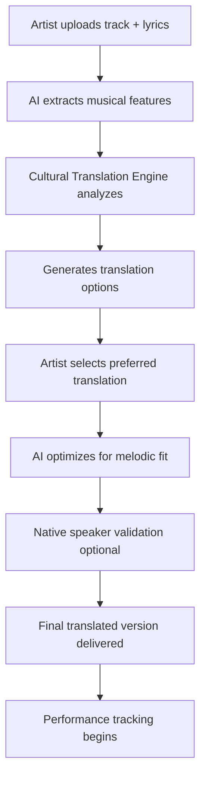
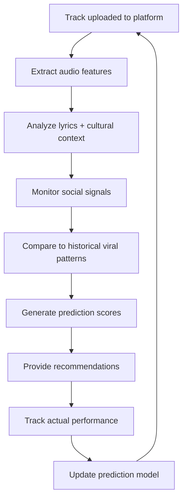
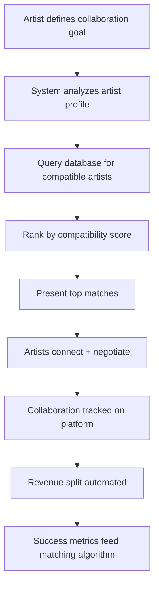
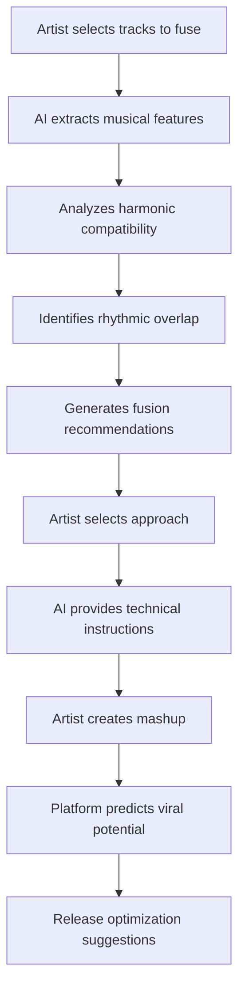

# Foreign Hit Translator: Platform Architecture

*Technical infrastructure for global music AI platform*

---

## 🏗️ System Architecture Overview

The Foreign Hit Translator platform is built as a **multi-layered AI-powered music marketplace** that connects independent musicians, collaborators, and industry stakeholders through intelligent matching and cultural translation capabilities.

---

## 🧠 Core AI Systems

### 1. Cultural Translation Engine

**Purpose:** Convert songs across languages while preserving melodic fit, emotional impact, and cultural resonance.

**Components:**
- **Syllabic Mapper**: Matches source language syllable patterns to target language equivalents
- **Rhyme Preservation Module**: Maintains poetic structure and rhyme schemes
- **Cultural Idiom Database**: 50+ languages, 10,000+ cultural expressions
- **Emotional Vector Analysis**: NLP-based sentiment mapping across cultures

**Technical Stack:**
- Transformer-based language models (fine-tuned on song lyrics)
- Phonetic analysis engine for syllable counting
- Cultural context embeddings
- Sentiment analysis (multilingual)

**Data Sources:**
- 10M+ song lyrics across 50+ languages
- Cultural idiom databases
- Native speaker validation sets
- Emotional resonance ratings

---

### 2. Viral Prediction Engine

**Purpose:** Forecast viral potential and predict hit trajectory 6 months in advance.

**Components:**
- **Pattern Recognition**: Identifies viral elements in music structure
- **Social Media Monitor**: Real-time trend detection across platforms
- **Market Analyzer**: Geographic and demographic targeting
- **Timeline Predictor**: Expected growth curves and peak timing

**Technical Stack:**
- Time-series forecasting models
- Social media API integrations (TikTok, Instagram, Twitter)
- Streaming platform analytics (Spotify, Apple Music, YouTube)
- Ensemble ML models (gradient boosting + neural networks)

**Input Features:**
- Musical features: Tempo, key, genre, structure
- Social signals: Engagement rates, share velocity
- Cultural timing: Events, trends, seasonal patterns
- Artist features: Follower count, previous performance
- Market features: Geographic trends, language penetration

**Output Metrics:**
- Viral Potential Score (0-10)
- Expected peak streams
- Timeline to viral threshold
- Geographic spread prediction
- Platform-specific performance

---

### 3. Cross-Cultural Mashup Engine

**Purpose:** Intelligently fuse multiple genres and cultural styles into viral content.

**Components:**
- **Harmonic Analyzer**: Key and chord progression compatibility
- **Rhythmic Fusion Module**: Polyrhythm and tempo synchronization
- **Genre DNA Mapper**: Style characteristics extraction
- **Cultural Balance Optimizer**: Authenticity vs. accessibility trade-offs

**Technical Stack:**
- Music Information Retrieval (MIR) algorithms
- Beat tracking and tempo detection
- Harmonic analysis (Essentia, Librosa)
- Genre classification models

**Fusion Strategies:**
- Tempo compromise algorithms
- Key transposition recommendations
- Structural arrangement optimization
- Instrumentation balance

---

### 4. Collaboration Matching System

**Purpose:** Connect artists with compatible collaborators across borders.

**Components:**
- **Style Similarity Engine**: Match artists by musical characteristics
- **Language Compatibility**: Multi-language capability matching
- **Audience Synergy Analyzer**: Combined reach calculation
- **Schedule Coordinator**: Timezone and availability matching

**Technical Stack:**
- Collaborative filtering algorithms
- Music similarity embeddings
- Graph-based network analysis
- Recommendation engine

**Matching Criteria:**
- Musical style compatibility (genre, tempo, mood)
- Language capabilities
- Geographic complementarity
- Audience size and overlap
- Previous collaboration success patterns
- Career stage alignment

---

## 🗄️ Data Infrastructure

### Database Schema

**Users Table:**
- Artist profiles (name, origin, genres, languages)
- Collaborator profiles (skills, availability, rates)
- Industry profiles (labels, platforms, forecasters)

**Tracks Table:**
- Metadata (title, artist, genre, BPM, key)
- Audio features (extracted via MIR)
- Lyrics (original + translations)
- Performance metrics (streams, geography, timeline)

**Translations Table:**
- Source track ID
- Target language
- Translation tier (basic/premium/enterprise)
- Syllabic mapping
- Cultural adaptations
- Quality ratings

**Collaborations Table:**
- Participating artists
- Track outputs
- Revenue splits
- Performance metrics
- Success ratings

**Predictions Table:**
- Track ID
- Prediction date
- Viral score
- Timeline forecast
- Geographic predictions
- Actual performance (for model training)

---

### Real-Time Data Pipelines

**Social Media Monitoring:**
- TikTok API: Video uploads, hashtag trends, audio usage
- Instagram API: Reels performance, music tags
- Twitter API: Music discussion sentiment
- Update frequency: Real-time streaming

**Streaming Platform Analytics:**
- Spotify API: Stream counts, playlist additions, geographic data
- YouTube API: Video views, comments, engagement
- Apple Music: Stream counts, chart positions
- Update frequency: Daily batch processing

**Cultural Trend Analysis:**
- News aggregation: Cultural events, festivals
- Search trends: Google Trends, music-specific searches
- Industry publications: Billboard, Rolling Stone, regional equivalents
- Update frequency: Daily

---

## 🔄 Platform Workflows

### Workflow 1: Music Translation



### Workflow 2: Viral Prediction



### Workflow 3: Collaboration Matching



### Workflow 4: Mashup Creation



---

## 💰 Revenue Model Implementation

### Transaction Processing

**Payment Flows:**
1. **Translation Services:**
   - One-time payment at service initiation
   - Tiered pricing (Basic/Premium/Enterprise)
   - Automated invoicing
   
2. **Collaboration Revenue:**
   - Smart contract-based splits
   - Automated distribution upon streaming revenue
   - Transparent reporting for all parties

3. **Data Licensing:**
   - Subscription model for industry partners
   - API access with rate limiting
   - Custom data exports (enterprise)

**Revenue Split Structure:**
- Platform fee: 4% of creator revenue
- Translation service: Flat fee (not %)
- Data licensing: 100% platform revenue
- Collaboration fee: 2% coordination fee from total project revenue

---

## 🔐 Security & Privacy

### Data Protection

**Artist IP Protection:**
- Encrypted audio file storage
- Watermarking for demos
- Access control (role-based)
- Version control and ownership tracking

**Privacy Measures:**
- GDPR compliance for European artists
- Data minimization principles
- Opt-in for data analytics
- Right to deletion

**Industry Data Access:**
- Anonymized aggregate data only
- No individual artist data without consent
- Rate-limited API access
- Audit logging

---

## 📊 Analytics Dashboard

### For Artists:

**Track Performance:**
- Real-time streaming metrics
- Geographic heatmap
- Viral trajectory vs. prediction
- Revenue tracking

**Collaboration Insights:**
- Match recommendations
- Success probability scores
- Network growth visualization

**Market Intelligence:**
- Target market opportunities
- Cultural trend alignment
- Competitive positioning

### For Industry Partners:

**Trend Detection:**
- Emerging genre identification
- Geographic hotspot mapping
- Artist momentum tracking
- Viral pattern analysis

**Market Intelligence:**
- Cross-cultural hit patterns
- Diaspora amplification metrics
- Prediction accuracy reports
- A&R intelligence feeds

---

## 🚀 Scalability Architecture

### Infrastructure:

**Cloud Platform:** AWS/GCP multi-region deployment

**Compute:**
- AI model serving: GPU instances for inference
- Audio processing: CPU-optimized instances
- Web services: Auto-scaling container clusters

**Storage:**
- Audio files: S3/Cloud Storage (multi-region)
- Database: PostgreSQL (primary) + Read replicas
- Cache: Redis for real-time data
- Analytics: Data warehouse (Snowflake/BigQuery)

**CDN:** CloudFront/Cloud CDN for global content delivery

---

## 🔬 AI Model Training Pipeline

### Continuous Improvement:

**Data Collection:**
- User feedback on translations
- Actual viral performance vs. predictions
- Collaboration success rates
- A/B test results

**Model Retraining:**
- Translation models: Monthly updates
- Prediction models: Weekly retraining
- Matching algorithms: Continuous learning
- Frequency based on data volume and drift detection

**Quality Assurance:**
- Human validation on sample outputs
- A/B testing new models vs. production
- Gradual rollout of improvements
- Rollback capability for model degradation

---

## 🌐 API Structure

### Public APIs (for partners):

**Prediction API:**
```
POST /api/v1/predict
{
  "track_id": "abc123",
  "target_markets": ["US", "BR", "KR"]
}

Response:
{
  "predictions": [
    {
      "market": "US",
      "viral_score": 7.8,
      "expected_streams": 2500000,
      "timeline_weeks": 8
    }
  ]
}
```

**Translation API:**
```
POST /api/v1/translate
{
  "track_id": "abc123",
  "source_language": "pt-BR",
  "target_language": "ko-KR",
  "tier": "premium"
}

Response:
{
  "translation_id": "xyz789",
  "status": "processing",
  "estimated_completion": "2024-11-01T12:00:00Z"
}
```

**Collaboration API:**
```
GET /api/v1/matches
{
  "artist_id": "artist123",
  "goal": "market_expansion",
  "target_region": "Latin America"
}

Response:
{
  "matches": [
    {
      "artist_id": "artist456",
      "compatibility_score": 8.9,
      "synergy_type": "genre_fusion",
      "expected_reach": 3500000
    }
  ]
}
```

---

## 📈 Performance Metrics

### System KPIs:

**AI Performance:**
- Translation quality score: >90%
- Viral prediction accuracy: >75% (±2M streams)
- Collaboration match satisfaction: >85%
- API uptime: >99.9%

**Business Metrics:**
- Active musicians: Target 100K by Year 2
- Successful collaborations: 1,000+ by Year 1
- Viral hits generated: 100+ by Year 1
- Prediction accuracy improvement: 5% YoY

**Platform Health:**
- Response time: <200ms (p95)
- Audio processing time: <5 minutes per track
- Translation delivery: <24 hours (premium), <7 days (enterprise)

---

## 🧩 Integration Points

### External Platforms:

**Streaming Services:**
- Spotify for Artists: Automatic data sync
- YouTube Music: Performance tracking
- Apple Music: Chart position monitoring

**Social Media:**
- TikTok: Trend detection, usage tracking
- Instagram: Reels performance analysis
- Twitter: Sentiment monitoring

**Music Tools:**
- DAWs: Plugin integration (future)
- Distribution platforms: DistroKid, TuneCore partnerships
- Rights management: Automatic royalty split reporting

---

## 🎯 Future Roadmap

### Phase 1 (Current): Core Platform
- Translation engine (3 tiers)
- Viral prediction (6-month horizon)
- Basic collaboration matching
- Web-based dashboard

### Phase 2 (6-12 months):
- Mobile apps (iOS/Android)
- Real-time collaboration tools
- Advanced mashup AI assistance
- Expanded language support (75+ languages)

### Phase 3 (12-24 months):
- DAW plugin integration
- AI vocal re-performance (voice cloning for demos)
- Live performance optimization
- VR collaboration spaces

### Phase 4 (24+ months):
- Blockchain-based rights management
- Decentralized artist collective features
- AI-generated music elements (ethical/opt-in)
- Global festival coordination platform

---

*This architecture is designed for scale, security, and continuous improvement. The platform grows smarter with every artist, every collaboration, and every viral hit.*
