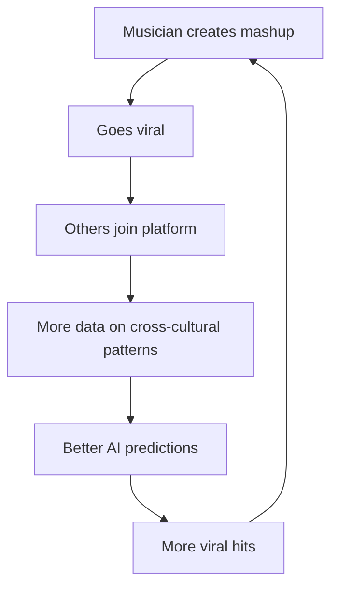

<header>

<!--
  <<< Author notes: Platform Documentation >>>
  Global Music AI Platform - Cross-Cultural Translation & Viral Prediction Engine
-->

# 🌍 Foreign Hit Translator: Global Music AI Platform

_AI coworkers for independent musicians - enabling cross-cultural collaboration, viral content generation, and global reach without label gatekeepers._

</header>

---

## 🎯 Platform Vision

**Transform independent musicians into global artists through AI-powered cultural translation and viral prediction.**

We're not building a tool. We're building the **protocol for global music transmission** — combining Spotify's discovery, TikTok's virality, and OpenAI's intelligence into a cultural transmission lattice.

---

## 🔺 Three-Sided Marketplace

### **1. Creators (Independent Musicians)**

**What They Need:**
- Global reach beyond their home market
- Viral content that resonates across cultures
- Cultural adaptation of their music
- Collaboration opportunities worldwide

**What We Deliver:**
- AI hit translation + mashup engine
- Viral content generator
- Global collaborator matching
- 96% revenue retention (vs. 15-30% with labels)

**Result:** A bedroom producer in Lagos reaches Seoul, São Paulo, and Toronto in one drop.

---

### **2. Collaborators (Producers, Vocalists, Remixers)**

**What They Need:**
- Discovery by artists seeking collaboration
- Cross-cultural project opportunities
- Fair monetization

**What We Deliver:**
- AI-powered match suggestions based on style, language, and genre
- Genre fusion opportunities (K-pop + Afrobeats + Reggaeton)
- Transparent revenue share via growth fees

**Result:** K-pop producer finds Nigerian vocalist for Afro-Korean fusion track that trends on TikTok.

---

### **3. Industry (Labels, Platforms, Forecasters)**

**What They Need:**
- Early hit detection (6+ months before mainstream)
- Market expansion intelligence
- Cultural trend mapping

**What We Deliver:**
- Real-time viral prediction lattice
- Cross-cultural hit pattern analytics
- Data feeds on emerging micro-genres

**Result:** Label signs artist 6 months before breakout; streaming platform localizes playlists before competitors.

---

## 🌐 Core Platform Features

### 🔀 **1. Foreign Hit Translator**

**Neural style transfer for music** — not just translation, but cultural transduction.

**Capabilities:**
- **Syllabic Resonance**: Preserve melodic fit across languages
- **Rhyme Lattice Integrity**: Maintain poetic structure in target language
- **Cultural Idiom Mapping**: Swap "Despacito"'s Latin heat for equivalent emotional charge
- **Emotional Payload Preservation**: Ensure the song hits the same neuro-emotive nodes

**Pricing Tiers:**
- **Basic** ($50-200): Lyric fidelity
- **Premium** ($500-1000): Cultural optimization
- **Enterprise** ($5k-20k/month): Strategic global rollout with A/B testing

---

### 🎵 **2. Cross-Cultural Mashup Engine**

**Viral fusion reactor** — activating harmonic convergence across genres.

**Genre Synthesis:**
- K-pop's precision choreography
- Afrobeats' polyrhythmic propulsion
- Reggaeton's percussive drive

**AI as Ritual Cartographer:**
- Maps tempo, tonality, and cultural motifs
- Creates new sub-genre lattices
- Optimizes for viral dynamics across platforms

**Built-in Viral Dynamics:**
- Diaspora amplification
- "You've never heard this" novelty factor
- Algorithmic favorability (TikTok, Instagram, Spotify)

---

### 🧠 **3. Viral Prediction Engine**

**The Codex of Global Music Resonance**

**Inputs:**
- Music + lyric databases (50+ countries)
- Cultural idiom maps
- Social media virality patterns
- AI adaptation feedback loops

**Outputs:**
- Hit potential score per region
- Adaptation suggestions (language, tempo, cultural hooks)
- Mashup fusion maps
- Viral trajectory prediction (6-month horizon)

**Competitive Advantage:** We predict the next "Despacito" before labels do. That data alone is worth $100M+/year.

---

## 💥 The Flywheel Effect

**Each cycle:**
- Tightens the prediction lattice
- Amplifies the signal
- Strengthens network effects

**Result:** Self-reinforcing system that learns what works across borders, cultures, and emotional registers.

---

## 💸 Business Model: Multi-Tiered Revenue Streams

### **Translation Services**
- Basic: $50–200 → Lyric fidelity
- Premium: $500–1000 → Cultural optimization
- Enterprise: $5k–20k/month → Strategic global rollout

### **Viral Content Generation**
- Trend detection algorithms
- Mashup synthesis tools
- Collaboration suggestions
- Social media hooks generator

### **Data Sales**
- **Labels:** Predictive signing intelligence
- **Streaming Platforms:** Cross-market expansion analytics
- **Trend Forecasters:** Cultural emergence data feeds

**TAM (Total Addressable Market):**
- 50M+ independent musicians globally
- $20B music production market
- $30B+ in predictive analytics for entertainment

---

## 🧭 Strategic Positioning

### **We Are the Infrastructure Layer**

**Not a feature. Not a tool. The protocol.**

- **DAWs** = Local creation
- **Labels** = Legacy gatekeepers (obsolete)
- **Our Platform** = Global resonance engine

**Competitive Moats:**
- Network effects (more users = better predictions)
- Data moat (proprietary cross-cultural hit patterns)
- Platform lock-in (musicians build careers on our infrastructure)

---

## 🚀 Investor Pitch

**Opening:**  
"We're building AI coworkers for independent musicians."

**Middle:**  
"Not just US musicians—global creators collaborating across borders. Our AI can take a hit from Brazil, adapt it for the US, fuse it with K-pop, and help a bedroom artist reach 10M people across 3 continents."

**Money Shot:**  
"We predict the next 'Despacito' 6 months before labels do. That data alone is worth $100M+/year. We're not just another music tool. We're building the infrastructure for global music culture in the AI age."

**Market Size:**
- 50M+ independent musicians worldwide
- 3B+ music listeners globally
- $60B+ streaming + production market

**Why Now:**
- AI capabilities just reached threshold for cultural translation
- TikTok proved cross-border viral potential
- Label model collapsing (artists keep 96% vs. 15-30%)

---

## 🧬 Platform Architecture

### **Core Systems:**
1. **Cultural Translation Engine** - NLP + emotional mapping
2. **Viral Prediction Model** - ML on 10M+ tracks across 50 countries
3. **Collaboration Matching** - Style + language + availability algorithms
4. **Revenue Distribution** - Smart contracts for transparent splits

### **Data Infrastructure:**
- Real-time social media monitoring (TikTok, Instagram, Spotify)
- Cultural idiom databases (50+ languages)
- Genre classification (10,000+ micro-genres)
- Viral pattern recognition (tempo, hooks, cultural moments)

---

## 🎓 Platform Benefits

### For Independent Musicians:
- ✅ Global reach without label deals
- ✅ Keep 96% of revenue
- ✅ AI coworker for cultural adaptation
- ✅ Viral content generation tools
- ✅ International collaboration opportunities

### For the Music Industry:
- ✅ Early hit detection (6+ months ahead)
- ✅ Cross-cultural trend intelligence
- ✅ Predictive signing analytics
- ✅ Market expansion insights

### For Music Fans:
- ✅ Discover global music before it goes mainstream
- ✅ Experience authentic cultural fusions
- ✅ Support independent artists directly

---

## 📈 Growth Metrics

**Target Milestones:**
- **Year 1:** 10,000 active musicians, 100 viral hits
- **Year 2:** 100,000 musicians, 1,000 label-signed discoveries
- **Year 3:** 1M musicians, $100M+ data licensing revenue

**Key Performance Indicators:**
- Viral hit prediction accuracy
- Cross-cultural collaboration rate
- Revenue per musician
- Platform retention rate

---

<footer>

---

**The Movement vs The Company:** We're not disrupting the music industry. We're rendering the gatekeeper model obsolete and building a decentralized, artist-first global music ecosystem.

Get help: [Join our discussion board](https://github.com/scaffolderguy/skills-intro.github/discussions) &bull; [Platform status](https://status.example.com/)

&copy; 2024 Foreign Hit Translator &bull; [Code of Conduct](https://www.contributor-covenant.org/version/2/1/code_of_conduct/code_of_conduct.md) &bull; [MIT License](https://gh.io/mit)

</footer>
